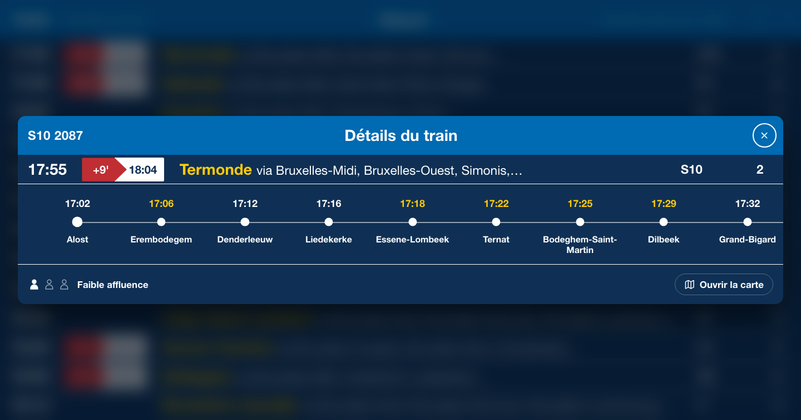
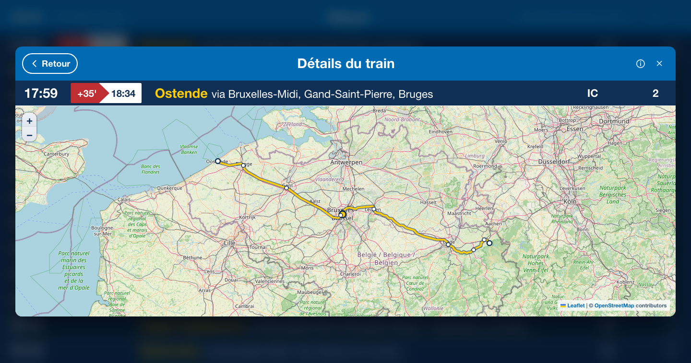

# Belgian Train Liveboard

Belgian Train Liveboard is an independent, unofficial, non-commercial web application for viewing live SNCB/NMBS departures in a station-display-inspired interface. It uses public railway information from [iRail](https://docs.irail.be/).

<p align="center">
  
</p>

## Features

- Live station departures, refreshed every 30 seconds
- Real-time delays, platforms, platform changes, cancellations, extra services, route changes, and service notices when supplied by iRail
- Search across Belgian stations using live iRail station data
- Direct From → To filtering based on each train's actual onward stops
- Train Details with a full route timeline, stop times, platforms, delays, and reported occupancy
- Optional interactive route map with pan, pinch, and zoom controls
- Dutch, French, English, and German interfaces
- Responsive desktop, tablet, and phone layouts
- Installable on supported devices for an app-like standalone experience.
- Shareable `?station=` and `?to=` URLs with readable station slugs
- Remembered station and language preferences
- Keyboard-accessible controls, focus-managed dialogs, and reduced-motion support

## Screenshots

<table>
  <tr>
    <td align="center" width="24%">
      <br>
      <sub>Phone layout</sub>
    </td>
    <td align="center" width="38%">
      <br>
      <sub>Train Details and route timeline</sub>
    </td>
    <td align="center" width="38%">
      <br>
      <sub>Train Details interactive map</sub>
    </td>
  </tr>
</table>

Screenshots show live data from Bruxelles-Central; displayed services vary with the current liveboard.

## Data Sources

- [iRail](https://docs.irail.be/) provides the station list, liveboard departures, delays, platforms, alerts, and train route information. The browser calls its public API directly; no private SNCB/NMBS API is used.
- [Infrabel Open Data](https://opendata.infrabel.be/) provides the public, CC0 railway datasets preprocessed into the local graph used for route geometry. Routes follow real infrastructure but are approximate; they do not claim to show the exact track used by a train.
- [OpenStreetMap](https://www.openstreetmap.org/copyright) contributors provide the map tiles and map-data attribution. OpenStreetMap is not a timetable source.
- [Leaflet](https://leafletjs.com/) renders the interactive map.

No API key is required.

## How It Works

Readable station slugs in the URL are resolved against iRail's station list. The application then uses the canonical iRail station ID for requests, so shared URLs remain human-readable without guessing railway identifiers.

The liveboard refreshes every 30 seconds and keeps the last valid board visible if a later refresh fails. From → To filtering checks every current departure progressively and includes a train only when the destination appears later in that train's `/vehicle` route. Missing or failed route data is treated as unconfirmed, not as proof that no direct train exists.

Train journey data is cached and shared between the board, filter, and details view. The map component, Leaflet bundle, and generated Belgian rail graph are loaded only after the map is opened.

## Tech Stack

- React 18
- Vite 5
- JavaScript and JSX
- Plain CSS
- Leaflet
- Native Fetch, History, and browser storage APIs

## Running Locally

```bash
git clone https://github.com/kaanddemir/belgian-train-liveboard.git
cd belgian-train-liveboard
npm install
npm run dev
```

`npm run dev` runs the project's local-development preflight before starting Vite. To start Vite directly, use `npm run dev:vite`.

Build and run the production version:

```bash
npm run build
npm run preview
```

There are no environment variables, backend services, or API credentials to configure.

## Architecture

This is a client-side Vite and React SPA built with function components, plain JavaScript, and one CSS stylesheet. Application state and the 30-second refresh lifecycle live in `src/App.jsx`; railway API access, normalization, pacing, and caching live in `src/services/irail.js`.

All iRail requests pass through one scheduler with global pacing and high/normal priorities. Train journey requests are serialized, deduplicated in flight, and stored in bounded session caches. URL state uses the native History API—there is no router or state-management library.

`TrainRouteMap.jsx` is dynamically imported from Train Details. It loads Leaflet and fetches `public/generated/belgian-rail-graph.json` only when needed. The graph is generated manually from Infrabel's public datasets with:

```bash
node scripts/data/build-rail-network.mjs
```

## Privacy

The application has no user accounts, authentication, analytics, tracking, or cookies. It stores only two preferences in `localStorage`:

- `lastStationSlug` — the last station selected
- `preferredLanguage` — the last language selected

Departure boards, train journeys, destination filters, and API caches are not persisted. Requests for railway data go directly from the browser to iRail; opening the optional map also requests the local rail graph and OpenStreetMap tiles.

## Disclaimer

This project is not official SNCB/NMBS software and is not affiliated with, endorsed by, or operated by SNCB/NMBS. Live times, delays, platforms, cancellations, and other service information may be incomplete, delayed, inaccurate, or temporarily unavailable. Consult [SNCB/NMBS](https://www.belgiantrain.be/) or the relevant railway operator for official travel information.

SNCB/NMBS names and trademarks remain the property of their respective owners.

## License

Released under the [MIT License](LICENSE).
