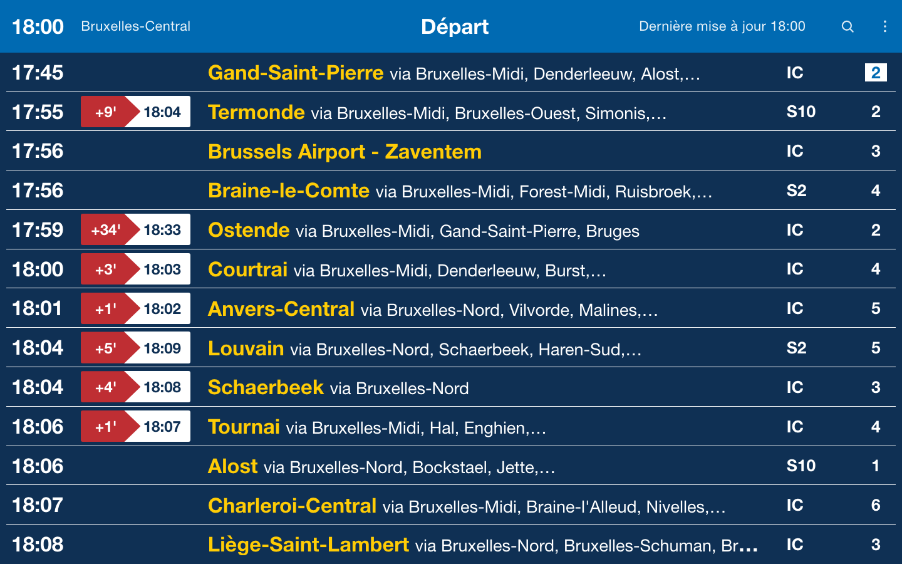
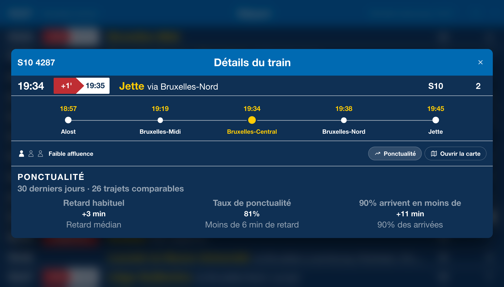
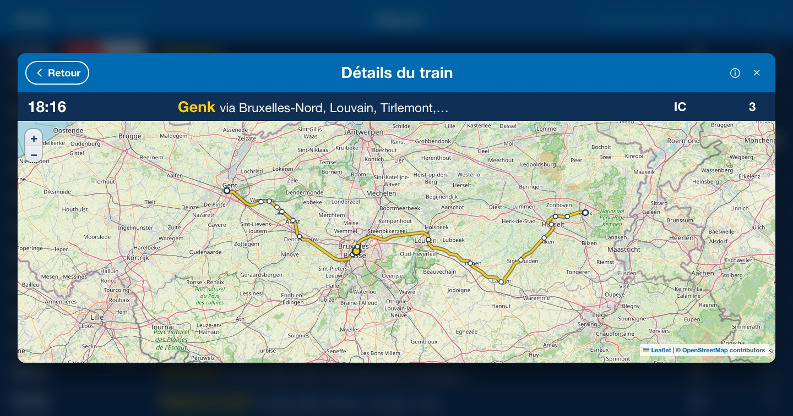
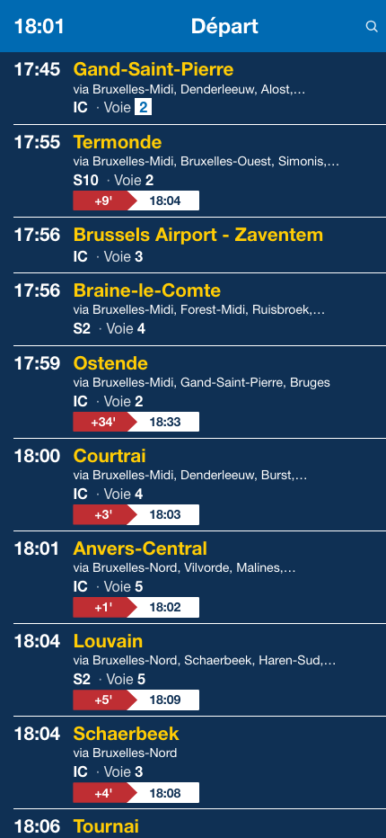
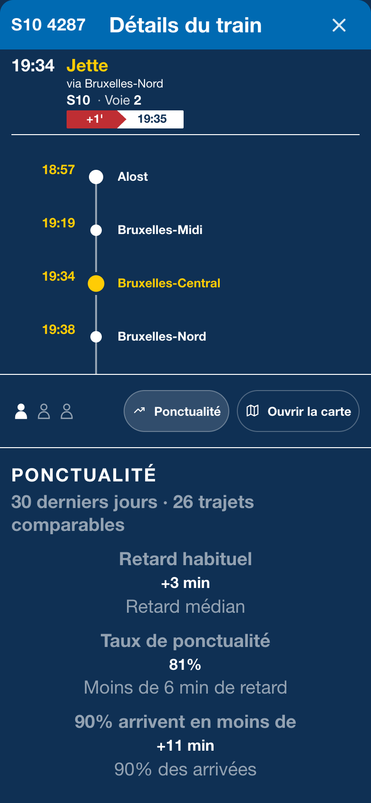
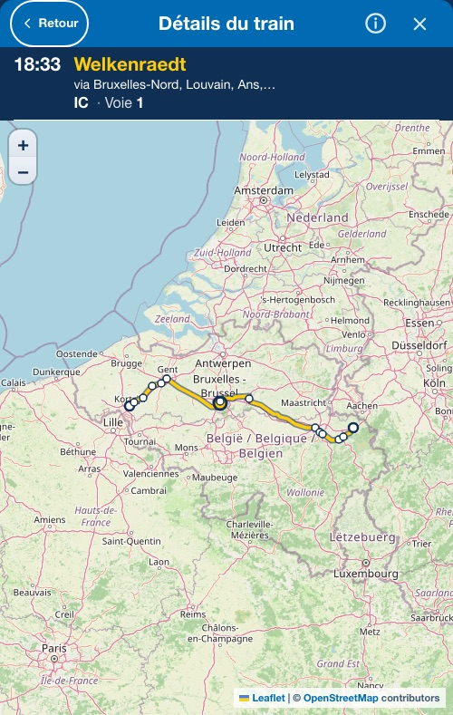

# Belgian Train Liveboard

Belgian Train Liveboard is an independent, unofficial, non-commercial web application for viewing live SNCB/NMBS departures in a station-display-inspired interface. It uses public railway information from [iRail](https://docs.irail.be/).



## Features

- Live station departures, refreshed every 30 seconds
- Real-time delays, platforms, platform changes, cancellations, extra services, route changes, and service notices when supplied by iRail
- Search across Belgian stations using live iRail station data
- Direct From → To filtering based on each train's actual onward stops
- Train Details with a full route timeline, stop times, platforms, delays, and reported occupancy
- Historical Performance for the opened train at the station on screen: Typical Delay, On-Time Rate, and 90% Arrive Within, over the most recent window the collected data covers
- Optional interactive route map with pan, pinch, and zoom controls
- Dutch, French, English, and German interfaces
- Responsive desktop, tablet, and phone layouts
- Installable on supported devices for an app-like standalone experience
- Shareable `?station=` and `?to=` URLs with readable station slugs
- Remembered station and language preferences
- Keyboard-accessible controls, focus-managed dialogs, and reduced-motion support

## Screenshots

### Desktop



*Train Details, route timeline and Historical Performance*



*Train Details interactive map*

### Mobile

<table>
  <tr>
    <td align="center" width="33%">
      <br>
      <sub><em>Liveboard</em></sub>
    </td>
    <td align="center" width="33%">
      <br>
      <sub><em>Train Details and Historical Performance</em></sub>
    </td>
    <td align="center" width="33%">
      <br>
      <sub><em>Train Details interactive map</em></sub>
    </td>
  </tr>
</table>

Screenshots show Bruxelles-Central; displayed services vary with the current liveboard. The two Train Details images are captured from the development fixture board (`?mock=1`), so the Historical Performance section is visible without a published aggregate.

## Data Sources

- [iRail](https://docs.irail.be/) provides the station list, liveboard departures, delays, platforms, alerts, and train route information. The browser calls its public API directly; no private SNCB/NMBS API is used.
- [Infrabel Open Data](https://opendata.infrabel.be/) provides the public, CC0 railway datasets preprocessed into the local graph used for route geometry. Routes follow real infrastructure but are approximate; they do not claim to show the exact track used by a train.
- Infrabel Open Data also provides the raw punctuality observations behind Historical Performance, via `ruwe-gegevens-van-stiptheid-d-1` (yesterday's arrivals and departures) and `stiptheid-gegevens-maandelijksebestanden` (the same rows per month, used for the initial backfill and to repair a missed day). The figures shown are calculated by this project, not published by Infrabel or SNCB/NMBS.
- [OpenStreetMap](https://www.openstreetmap.org/copyright) contributors provide the map tiles and map-data attribution. OpenStreetMap is not a timetable source.
- [Leaflet](https://leafletjs.com/) renders the interactive map.

No API key is required.

## Tech Stack

- React 18
- Vite 5
- JavaScript and JSX
- Plain CSS
- Leaflet
- Native Fetch, History, and browser storage APIs

## Running Locally

Requires [Node.js](https://nodejs.org/) 18 or newer, as used by Vite 5.

```bash
git clone https://github.com/kaanddemir/belgian-train-liveboard.git
cd belgian-train-liveboard
npm install
npm run dev
```

`npm run dev` runs the project's local-development preflight before starting Vite. To start Vite directly, use `npm run dev:vite`.

Build and run the production version:

```bash
npm run build
npm run preview
```

There are no environment variables, backend services, or API credentials to configure.

## Architecture

Application state and the 30-second refresh lifecycle live in `src/App.jsx`, which passes data down to presentational components; railway API access, normalization, pacing, and caching live in `src/services/irail.js`. URL state uses the native History API—there is no router or state-management library.

Readable station slugs in the URL are resolved against iRail's station list. The application then uses the canonical iRail station ID for requests, so shared URLs remain human-readable without guessing railway identifiers.

The liveboard refreshes every 30 seconds and keeps the last valid board visible if a later refresh fails. From → To filtering checks every current departure progressively and includes a train only when the destination appears later in that train's `/vehicle` route. Missing or failed route data is treated as unconfirmed, not as proof that no direct train exists.

All iRail requests pass through one scheduler with global pacing and high/normal priorities. Train journey requests are serialized, deduplicated in flight, and stored in bounded session caches, so a single journey lookup serves the board, the filter, and the details view alike.

`TrainRouteMap.jsx` is dynamically imported from Train Details. It loads Leaflet and fetches `public/generated/belgian-rail-graph.json` only when the map is opened, keeping both off the initial board load. The graph is generated manually from Infrabel's public datasets with:

```bash
node scripts/data/build-rail-network.mjs
```

### Historical Performance

Performance is **historical, not predictive**. It answers one question — how this train has actually run *at the station on screen* — and it never forecasts today's train.

Its identity is `(departure.trainNumber, normalized current board station)`: the iRail train number is the same integer as Infrabel's `TRAIN_NO`, and the station is normalized through `stationPerformanceKey()` in `src/data/rail/normalizeStationName.js`, the same contract the route map's station matching uses. An Infrabel stopping point that is not a known iRail passenger station — a junction, siding, depot or freight point — never enters the data.

The figures are calculated by this project from [Infrabel Open Data](https://opendata.infrabel.be/) historical arrival delays (`DELAY_ARR`). They are not official Infrabel or SNCB/NMBS statistics, they are not a prediction about today's train, and they describe this train **at this station only** — not the performance of its whole route.

#### Metrics

Three metrics are published, computed **only from the selected window's days**, all from the same sample of signed arrival delays in seconds (early arrivals keep their negative sign and are never clamped).

##### Typical Delay

Median historical arrival delay for this train at the current station.

```text
+3 min
```

Minimum sample: `n >= 10`.

##### On-Time Rate

Share of comparable arrivals delayed by less than 6 minutes — `DELAY_ARR < 360` seconds.

```text
81%
```

Minimum sample: `n >= 10`.

##### 90% Arrive Within

90th percentile of the arrival delay, rounded up. `+11 min` means 90% of comparable arrivals were no more than 11 minutes late.

```text
+11 min
```

Minimum sample: `n >= 20`.

#### Reading the meta line

```text
Last 30 days · 26 comparable journeys
```

- the selected recent window is 30 calendar days;
- 26 valid observations for this train at this station were used.

A calendar day in the window does not necessarily produce an observation: a train that did not run that day simply contributes none, which is why the sample count is always shown beside the window.

#### Adaptive window

The build picks the largest trailing window the dataset genuinely covers:

| Coverage | Window shown |
| --- | --- |
| trailing 30 calendar days, at least 27 covered | `Last 30 days` |
| otherwise trailing 15 calendar days, at least 14 covered | `Last 15 days` |
| otherwise all 10 trailing calendar days covered | `Last 10 days` |
| otherwise | `Collecting history` |

Windows are measured over real trailing calendar dates ending at the newest service day, so scattered older dates are never labelled "Last 10 days". Daily ingestion moves that coverage forward on its own, and a monthly backfill repairs days that were missed.

Ten days is the shortest window offered, and it requires all ten days: a train calls at a station about once a day, so a shorter window — or a ten-day window with a gap — could not reach the ten observations a median or a percentage needs, and would have shown a real-looking label above no figures.

Below ten observations the panel names the sample and says the data is insufficient rather than printing a figure; between ten and twenty the `90% Arrive Within` row simply does not render. One sample count covers all three metrics, and it is always shown.

Note that the thresholds count observations inside the *selected* window, and reaching ten needs ten covered days — which is why the shortest window demands all of them.

The section is always present, from the moment the panel opens — it shows a loading line while its shard is fetched, and a shard already in hand renders without one. When no window qualifies it shows `Collecting history · N days available`; when the dataset is more than a week out of date it says so; when a train has never been seen at the station it says there is no history yet. It never shows a figure it cannot stand behind, and it never disappears.

The browser never contacts Infrabel, never downloads a CSV and never computes a statistic. It lazily fetches one small static shard — `generated/performance/<trainNumber / 100>.json` — when Train Details is opened, and memoizes it for the session. The board itself fetches nothing. Every failure resolves to nothing rendered: Performance can never break Train Details, the timeline or the map.

Ingestion runs entirely in the background, in `.github/workflows/punctuality.yml`, three times a day. Because Infrabel overwrites its D-1 dataset every morning, a missed day is repaired from the monthly file rather than lost.

The rolling 30-day state and the generated shards live on a dedicated orphan `data` branch, which shares no history with `main`, is never merged, and is force-replaced as a single commit only after a fully validated update. **Neither the raw observations nor the daily generated output is ever committed to `main`**, whose history therefore does not grow with the data. The Pages deploy copies the shards from `data` into `dist/generated/performance/` when it builds the site.

Run the pipeline by hand against a local state directory (git-ignored, never committed):

```bash
node scripts/data/build-punctuality.mjs --daily             # ingest the published D-1 day
node scripts/data/build-punctuality.mjs --backfill 202608   # seed or repair from a monthly file
node scripts/data/build-punctuality.mjs --aggregate         # rebuild the shards from state
```

An ingest that fails validation — implausible row, train or stopping-point counts, or a station match rate that has drifted below its established level — publishes nothing, so the last good aggregate stays live. Structural invariants on the generated files are checked on every path; only an explicit `--backfill` may grow the aggregate past the daily size-drift guard, since filling a gap is exactly what it is for. Nothing is written until every check passes.

## Privacy

The application has no user accounts, authentication, analytics, tracking, or cookies. It stores only three preferences in `localStorage`:

- `lastStationSlug` — the last station selected
- `preferredLanguage` — the last language selected
- `favoriteStationSlugs` — up to 5 favourite station slugs

Departure boards, train journeys, destination filters, and API caches are not persisted. Requests for railway data go directly from the browser to iRail; opening the optional map also requests the local rail graph and OpenStreetMap tiles.

## Disclaimer

This project is not official SNCB/NMBS software and is not affiliated with, endorsed by, or operated by SNCB/NMBS. Live times, delays, platforms, cancellations, and other service information may be incomplete, delayed, inaccurate, or temporarily unavailable. Consult [SNCB/NMBS](https://www.belgiantrain.be/) or the relevant railway operator for official travel information.

SNCB/NMBS names and trademarks remain the property of their respective owners.

## License

Released under the [MIT License](LICENSE).
